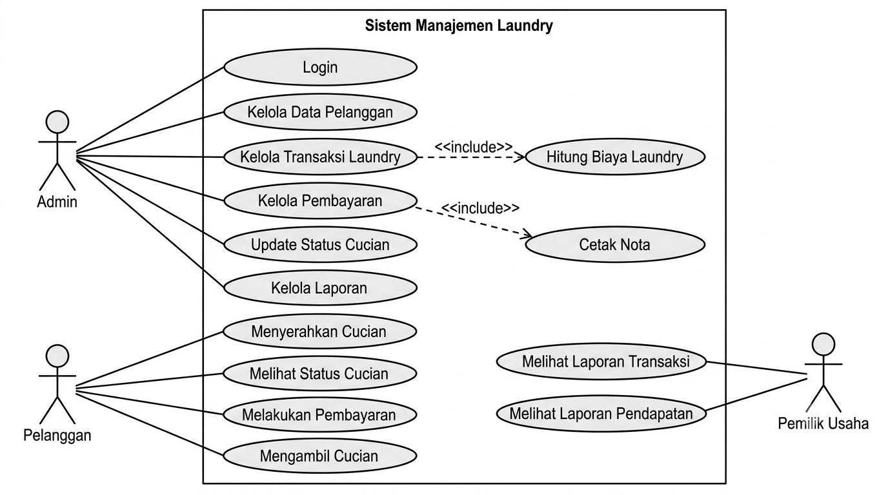
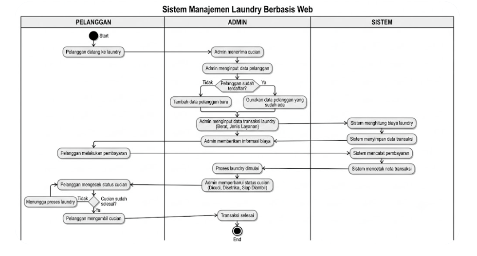
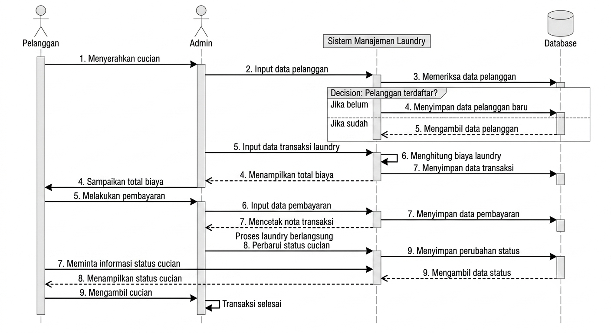
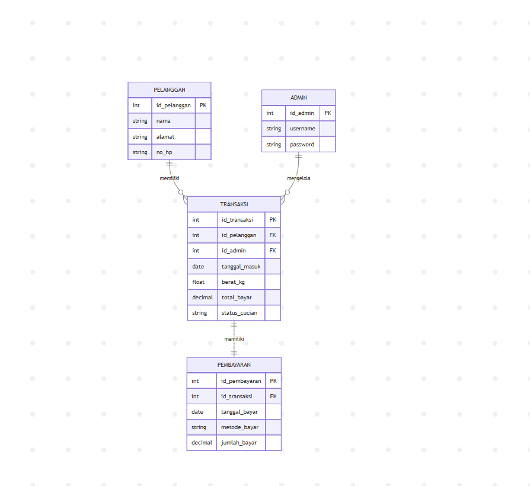
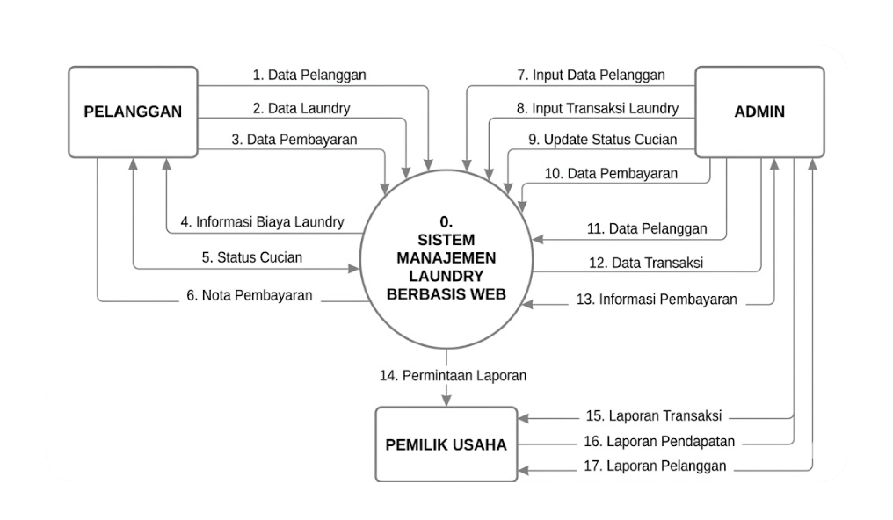
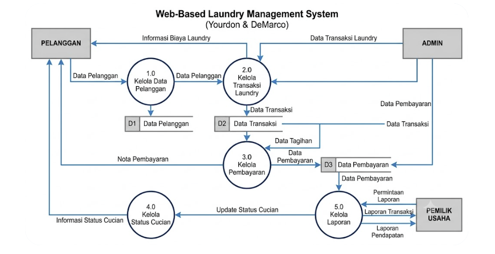
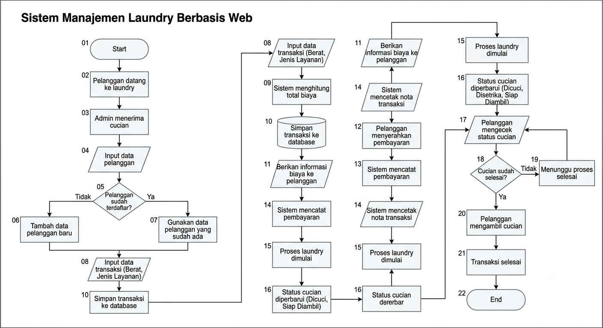

# Sistem Manajemen Laundry Berbasis Web

## Identitas Penyusun

| Keterangan | Data |
|------------|------|
| Nama | Gloria Thanos |
| NIM | 20240801167 |
| Mata Kuliah | Analisis dan Perancangan Sistem Informasi (APSI) |
| Pertemuan | 9 |

---

# 1. Latar Belakang

Perkembangan teknologi informasi telah mendorong berbagai usaha untuk melakukan digitalisasi proses bisnis, termasuk pada bidang jasa laundry. Saat ini, banyak usaha laundry masih menggunakan sistem pencatatan manual untuk mengelola data pelanggan, transaksi, pembayaran, dan status cucian. Metode tersebut sering menimbulkan berbagai kendala, seperti kehilangan data pelanggan, kesalahan pencatatan transaksi, kesulitan dalam memantau status cucian, serta lambatnya proses pembuatan laporan operasional.

Selain itu, pelanggan sering mengalami kesulitan dalam mengetahui status cucian mereka karena harus menghubungi pihak laundry secara langsung. Oleh karena itu, dibutuhkan sebuah Sistem Manajemen Laundry Berbasis Web yang mampu mengintegrasikan pengelolaan pelanggan, transaksi laundry, pembayaran, pelacakan status cucian, serta pelaporan secara otomatis dan real-time sehingga dapat meningkatkan efisiensi operasional dan kualitas layanan kepada pelanggan.

# 2. Tujuan Bisnis

* Mempermudah pengelolaan data pelanggan secara terpusat dan terorganisir.
* Membantu admin dalam mencatat transaksi laundry secara cepat dan akurat.
* Mengotomatisasi proses perhitungan biaya laundry berdasarkan layanan dan berat cucian.
* Memudahkan pelanggan dalam mengetahui status cucian mereka secara real-time.
* Menyediakan laporan transaksi dan pendapatan secara otomatis untuk membantu pengambilan keputusan bisnis.
* Mengurangi kesalahan pencatatan yang sering terjadi pada proses manual.

# 3. Ruang Lingkup Sistem

Sistem mencakup pengelolaan data pelanggan, pencatatan transaksi laundry, pengelolaan status cucian, proses pembayaran, serta pembuatan laporan operasional. Sistem juga menyediakan fitur pelacakan status cucian mulai dari proses penerimaan hingga pengambilan oleh pelanggan.

Sistem tidak mencakup layanan antar-jemput cucian, integrasi dengan jasa pengiriman eksternal, maupun pembayaran melalui cryptocurrency. Fokus utama sistem adalah digitalisasi proses operasional laundry yang berjalan di dalam usaha laundry itu sendiri.

# 4. Pemangku Kepentingan (Stakeholders)

## Pelanggan

Pelanggan dapat:

- Melakukan pendaftaran data pelanggan
- Menyerahkan cucian
- Melihat status cucian
- Melakukan pembayaran
- Mengambil cucian yang telah selesai

## Admin

Admin memiliki hak akses untuk:

- Login ke sistem
- Mengelola data pelanggan
- Mengelola data transaksi laundry
- Mengubah status cucian
- Mengelola pembayaran
- Melihat dan mencetak laporan

## Pemilik Usaha

Pihak yang memantau laporan transaksi, pendapatan, jumlah pelanggan, dan performa operasional usaha laundry untuk kebutuhan pengambilan keputusan bisnis.

# 5. Kebutuhan Fungsional

1. Sistem dapat mengelola data pelanggan meliputi tambah, ubah, hapus, dan pencarian data pelanggan.
2. Sistem dapat mencatat transaksi laundry berdasarkan jenis layanan dan berat cucian.
3. Sistem dapat menghitung total biaya laundry secara otomatis.
4. Sistem dapat menyimpan riwayat transaksi pelanggan ke dalam database.
5. Sistem dapat memperbarui status cucian dengan kategori:

   * Diterima
   * Dicuci
   * Disetrika
   * Siap Diambil
   * Selesai
6. Sistem dapat mencatat dan memverifikasi pembayaran pelanggan.
7. Sistem dapat mencetak nota transaksi dan pembayaran.
8. Sistem dapat menampilkan status cucian kepada pelanggan.
9. Sistem dapat menghasilkan laporan transaksi harian, mingguan, dan bulanan.
10. Sistem dapat menampilkan informasi pendapatan usaha berdasarkan periode tertentu.

---

# Diagram Sistem

Repository ini dilengkapi dengan beberapa diagram analisis dan perancangan sistem, yaitu:

- Use Case Diagram
- Activity Diagram
- Sequence Diagram
- Entity Relationship Diagram (ERD)
- Data Flow Diagram (DFD) Level 0
- Data Flow Diagram (DFD) Level 1
- Flowchart Sistem

---

# Komponen Diagram Sistem

## 1. Use Case Diagram

Use Case Diagram menggambarkan interaksi antara aktor dengan sistem. Pada Sistem Manajemen Laundry terdapat tiga aktor utama yaitu Admin, Pelanggan, dan Pemilik Usaha.

### Penjelasan

#### Admin
- Login ke sistem
- Mengelola data pelanggan
- Mengelola transaksi laundry
- Mengelola pembayaran
- Mengubah status cucian
- Mencetak laporan

#### Pelanggan
- Menyerahkan cucian
- Melakukan pembayaran
- Melihat status cucian
- Mengambil cucian

#### Pemilik Usaha
- Melihat laporan transaksi
- Melihat laporan pendapatan

---

## 2. Activity Diagram

Activity Diagram menggambarkan alur proses bisnis mulai dari pelanggan menyerahkan cucian hingga cucian selesai diambil.

### Penjelasan

Proses dimulai ketika pelanggan menyerahkan cucian kepada admin. Admin mencatat data pelanggan dan transaksi laundry. Sistem menghitung biaya secara otomatis dan menyimpan data transaksi. Setelah proses pencucian selesai, admin memperbarui status cucian hingga pelanggan melakukan pembayaran dan mengambil cucian.

---

## 3. Sequence Diagram

Sequence Diagram menunjukkan urutan interaksi antar objek dalam sistem selama proses transaksi laundry berlangsung.

### Penjelasan

Objek yang terlibat:

- Pelanggan
- Admin
- Sistem Laundry
- Database

Diagram menunjukkan proses input transaksi, penyimpanan data, pembayaran, dan pembaruan status cucian.

---

## 4. Entity Relationship Diagram (ERD)

ERD digunakan untuk menggambarkan struktur database dan hubungan antar entitas dalam sistem, terdiri dari empat entitas utama yaitu Pelanggan, Admin, Transaksi, dan Pembayaran. Hubungan antar entitas memungkinkan sistem mengelola data pelanggan, transaksi laundry, serta pembayaran secara terintegrasi sehingga proses operasional laundry menjadi lebih terstruktur dan efisien.

### Penjelasan ERD   

Entitas utama:

#### Admin
- id_admin (PK)
- username
- password

#### Pelanggan
- id_pelanggan (PK)
- nama
- alamat
- no_hp

#### Transaksi
- id_transaksi (PK)
- id_pelanggan (FK)
- tanggal_masuk
- berat_kg
- total_bayar
- status_cucian

#### Pembayaran
- id_pembayaran (PK)
- id_transaksi (FK)
- tanggal_bayar
- metode_bayar

Relasi:

- Pelanggan memiliki banyak transaksi (1:N)
- Transaksi memiliki satu pembayaran (1:1)
- Admin mengelola transaksi

---

## 5. Data Flow Diagram (DFD) Level 0

DFD Level 0 menggambarkan hubungan antara entitas eksternal dengan sistem secara keseluruhan.

### Penjelasan

Entitas eksternal:

- Pelanggan
- Admin
- Pemilik Usaha

Proses utama:

- Sistem Manajemen Laundry

Aliran data:

- Data pelanggan
- Data transaksi
- Data pembayaran
- Laporan transaksi

---

## 6. Data Flow Diagram (DFD) Level 1

DFD Level 1 digunakan untuk menggambarkan proses-proses utama yang terjadi dalam Sistem Manajemen Laundry secara lebih rinci. Diagram ini merupakan pengembangan dari DFD Level 0 dengan memecah proses utama menjadi beberapa subproses yang saling berhubungan dengan data store dan entitas eksternal.

### Penjelasan

Proses:

#### 1.0 Kelola Data Pelanggan
Menyimpan dan memperbarui data pelanggan.

#### 2.0 Kelola Transaksi Laundry
Mengelola transaksi laundry dan perhitungan biaya.

#### 3.0 Kelola Pembayaran
Mengelola pembayaran pelanggan.

#### 4.0 Kelola Status Cucian
Mengubah status cucian sesuai progres pengerjaan.

#### 5.0 Kelola Laporan
Menghasilkan laporan transaksi dan pendapatan.

---

## 7. Flowchart Sistem

Flowchart menggambarkan alur kerja sistem secara keseluruhan.

### Penjelasan

1. Pelanggan datang ke laundry.
2. Admin mencatat data pelanggan.
3. Admin memasukkan data cucian.
4. Sistem menghitung biaya.
5. Data transaksi disimpan.
6. Cucian diproses.
7. Status cucian diperbarui.
8. Pelanggan melakukan pembayaran.
9. Nota dicetak.
10. Pelanggan mengambil cucian.
11. Proses selesai.

---

# Kesimpulan

Sistem Manajemen Laundry Berbasis Web dapat membantu meningkatkan efisiensi operasional usaha laundry melalui pengelolaan data yang terintegrasi. Dengan sistem ini, proses pencatatan transaksi, pemantauan status cucian, pembayaran, dan pelaporan dapat dilakukan dengan lebih cepat, akurat, dan terorganisir.

---

Repository ini dibuat sebagai tugas mata kuliah Analisis dan Perancangan Sistem Informasi (APSI).